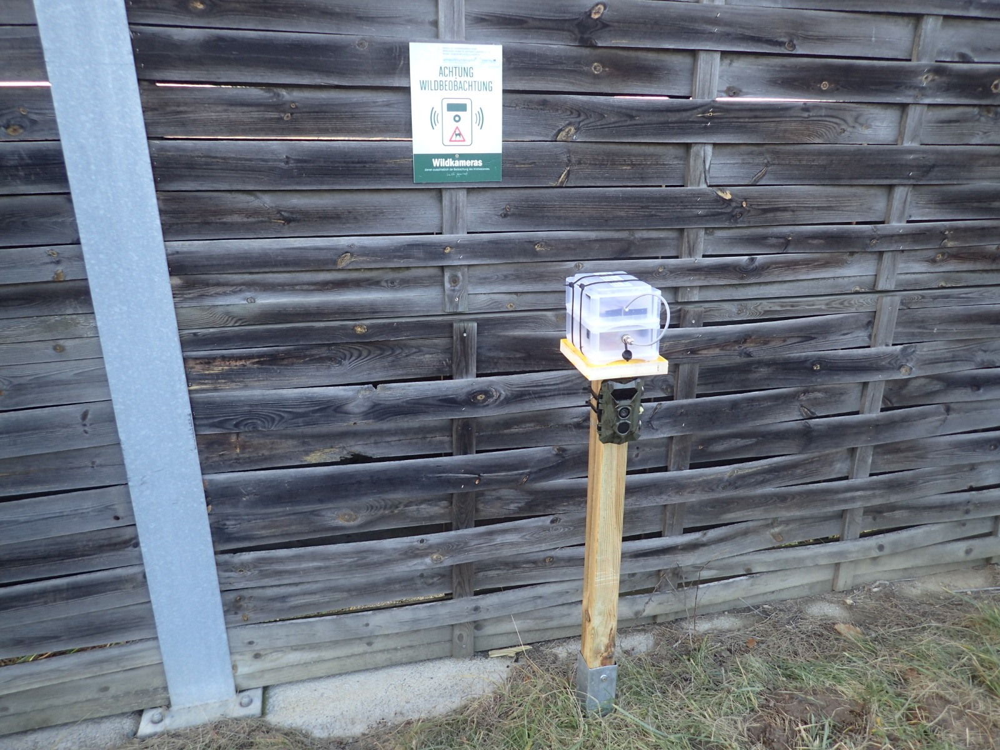

# Messung von Licht- und Lärm-Emissionen

Datalogger auf Arduino-Basis zur regelmäßigen Messung von Licht- und Lautstärke.

## Konzept

Zur regelmäßigen Messung von Licht- und Lärmbelastungen auf bzw. in der Nähe von Grünbrücken an Autobahnen und Schnellstraßen wurde ein offline Datalogger entwickelt.
Basis des Dataloggers ist ein Arduino Mikrocontroller, der die erhobenen Daten auf einer SD-Karte ablegt und eine Akkulaufzeit von mind. 45 Tagen aufweist.
Alle 45 Tage werden die Daten direkt am Datalogger abgeholt und die Akkus gewechselt.
Indem die Lösung in zwei separate Einheiten aufgeteilt wurde, kann der Austausch direkt durch Wechsel der Batterie-/Speichereinheit erreicht werden.
Die Sensor-/Messeinheit bleibt davon unberührt. Die beiden Einheiten sind mittels 8-poligem Daten- und Stromkabel verbunden und Teil einer [Messplattform](#schematischer-aufbau).

Bei Verbindung der beiden Einheiten und damit Herstellung der Stromversorgung des Mikrocontrollers wird die Initialisierungsroutine durchlaufen.
Die Initialisierung prüft die erfolgreiche Verbindung des Mikrocontrollers mit den Sensoren und dem SD-Karten Modul.
Nach deren erfolgreichen Abschluss blinkt die grüne LED mehrmals. Im Fehlerfall leuchtet die rote LED durchgehend.
Danach wird automatisch in einem wählbaren Intervall die Messung vorgenommen, auf die SD-Karte gespeichert und der Mikrocontroller wieder in den Ruhezustand versetzt bis die nächste Messung ansteht.

## Komponenten

Die folgenden Komponenten und Materialien werden für einen Datalogger verwendet:

- Mikrocontroller - [Arduino Pro Mini](https://docs.arduino.cc/retired/boards/arduino-pro-mini)
- Real-time Clock (RTC) Modul - [RTC DS3231](https://www.az-delivery.de/products/ds3231-real-time-clock)
- Lichtsensor Modul (0,001 - 1 000 Lux) - [Adafruit TSL2591](https://www.exp-tech.de/sensoren/licht/5226/adafruit-tsl2591-high-dynamic-range-digital-light-sensor)
- Mikrofon Modul (2x) (30 dBA - 80+ dBA) - [Max9814](https://www.az-delivery.de/products/max9814-mikrofon)
- SD-Card Modul + 16 GB Micro-SD Karte [SPI Reader Micro](https://www.az-delivery.de/en/products/copy-of-spi-reader-micro-speicherkartenmodul-fur-arduino)
- LED Grün
- LED Rot
- Li-Ion Akku 18650 (4x)
- Akkuhalterung für 2 Akkus (2x)
- PTC
- Batteriemanagement Modul
- Widerstand
- Wasserdichter Stecker und Buchse (8-pol)
- Kunststoffschachtel mit Deckel
- Verbrauchsmaterial wie 8-pol Kabel, Drähte, Buchsenleisten, Lötzinn, etc.
- Befestigungsmaterial wie Klettband, doppelseitiges Klebeband, Heißkleber, etc.

## Schematischer Aufbau

Der Aufbau der Messplattform wird in folgender schematischer Darstellung ersichtlich:

Auf einem Steher, der im Boden verankert ist, befinden sich optional eine oder zwei Wildtierkameras und eine Montageplatte. Auf der Montageplatte sind übereinander die beiden Einheiten des Dataloggers befestigt. Diese sind mit einem 8-poligen Stecker miteinander verbunden und mit Montagebändern an der Platte befestigt, wobei sichergestellt sein muss, dass die Sensoren von den Bändern nicht beeinträchtigt sein dürfen.

## Schaltplan der beiden Einheiten

Der Schaltplan der beiden Einheiten (Sensor-/Messeinheit und Batterie-/Speichereinheit) wird in folgender Grafik dargestellt:

## Aktuelle Firmware

Die Arduino Firmware zur Aufzeichnung der Licht- und Lärm-Emissionen befindet sich [hier](arduino-firmware/Arduino_Pro_Mini_Sensor_Box/Arduino_Pro_Mini_Sensor_Box.ino).

Bitte beachten Sie die Kommentare zu den relevaten Methoden direkt in der .ino Datei.

## Initialisierung der RTC

Vor erstmaliger Inbetriebnahme ist es notwendig die RTC (Real-time-clock) mit der aktuellen Uhrzeit zu initialisieren. Die entsprechende Firmware befindet sich [hier](arduino-firmware/RTC_Initialisierung_UTC/RTC_Initialisierung_UTC.ino).

Die Firmware setzt die Zeit auf der RTC auf die aktuelle Buildzeit. Danach sollte dieselbe Firmware nochmal mit auskommentierter Anweisung ``rtc.adjust`` aufgespielt werden um zu verhindern, dass bei jedem Start des Mikrocontrollers die RTC auf die (bis dahin veraltete) Buildzeit gesetzt wird.

_Hinweis:_ Vor dem Flashen der Firmware sollte die Uhrzeit des Rechners auf UTC-Zeit umgestellt werden, sodass die Daten konsistent in UTC-Uhrzeit aufgezeichnet werden.

## Auswertung

Die aufgenommenen Daten liegen im Klartext als CSV-File gespeichert auf der SD-Karte. Die Spalten des CSV-Formats beinhalten folgende Daten:

- Datum
- Uhrzeit
- Lichtstärke Lux
- Rohdaten Lichtsensor (Anteil Infrarot)
- Rohdaten Lichtsensor (Gesamtes Spektrum)
- Rohdaten Lichtsensor (Anteil sichtbares Licht)
- Signal Links (Mikrofon analoger Messwert links)
- Frequenz Links (Frequenz mit der höchsten Amplitude)
- Signal Rechts (Mikrofon analoger Messwert rechts)
- Frequenz Rechts (Frequenz mit der höchsten Amplitude)

Zur Auswertung der Lautstärkedaten ist es noch erforderlich, die analogen Werte in dBA umzurechnen. Dazu wurde eine Excel-Tabelle mit Kalibrierungsdaten für unterschiedliche Lautstärken und Frequenzen erhoben, die sich [hier](raw-data-interpolation/Calibration-Matrix.xlsx) befindet. Zur Umrechnung wird ein R-script verwendet, das als Input das CSV-File mit den Rohdaten und die Kalibrierungsmatrix benötigt, als Output die interpolierten Lautstärken anhängt und als neues CSV-File speichert. Das R-script befindet sich [hier](raw-data-interpolation/dBA_calculator.R).

## Impressionen

----

Made with :heart: by [Spatial Focus](https://spatial-focus.net/)
